# XE3JAC — José Antonio Castañeda Audiffred

  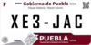

  <strong>Radioaficionado · Informática · Electrónica · APRS · SDR · Raspberry Pi · Open Source</strong> 
  Puebla, México 🇲🇽

  <code>APRS / WX</code> ·
  <code>DMR / NXDN</code> ·
  <code>EchoLink</code> ·
  <code>AllStarLink</code> ·
  <code>DAPNET</code> ·
  <code>TinyGS</code> ·
  <code>OpenWebRX+</code> ·
  <code>POTA</code>

  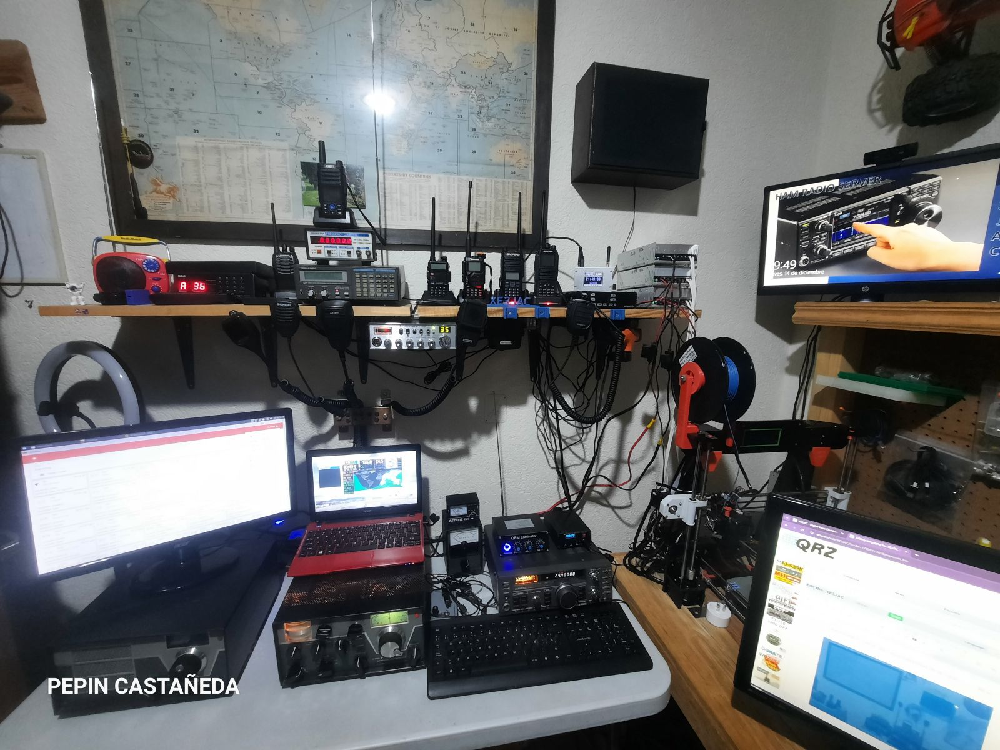

## 👋 Sobre XE3JAC

Soy **José Antonio Castañeda Audiffred — XE3JAC**, radioaficionado mexicano, **Licenciado en Informática** y **Maestro en Migración de Sistemas Computacionales**.

Mi estación es también un laboratorio donde conviven **radiofrecuencia, software, redes, electrónica, microcontroladores, Raspberry Pi, SDR, APRS, restauración de equipos, fabricación digital e impresión 3D**.

### Comunidades

- **Federación Mexicana de Radio Experimentadores**
- **Alfa Delta DX Group — 10AD1986**
- **HamSphere — XE3JAC**

## 📻 Radio Shack

Mi Shack está en constante evolución. Integra equipos **HF/VHF/UHF**, nodos digitales, servidores de radio, receptores SDR, proyectos APRS y herramientas para electrónica e impresión 3D.

  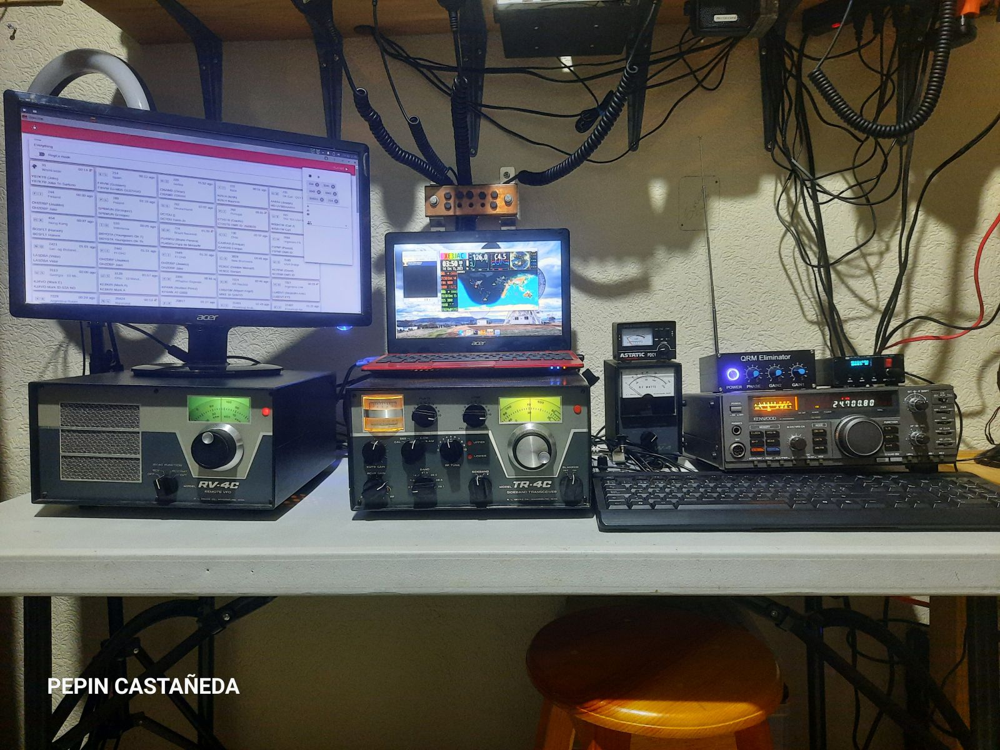
  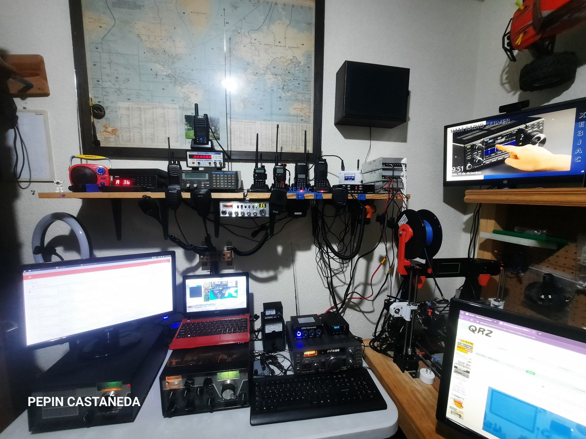

## 🧪 Proyectos y tecnologías

### 📡 APRS / WX / Indy Open APRS

Trabajo con distintos proyectos APRS, incluyendo estaciones meteorológicas, iGate, **APRS en VHF 144.390 MHz** y experimentación con **LoRa en 433 MHz**.

  

Uno de los proyectos actuales es [**Indy Open APRS**](https://github.com/XE3JAC/IndyOpen-APRS-Project), orientado a mantener una plataforma APRS/iGate **abierta, documentada, actualizable y preparada para seguir evolucionando**.

### 🌐 DMR · NXDN · EchoLink · AllStarLink

También experimento con **DMR, NXDN, EchoLink y AllStarLink**, además de infraestructura UHF para el área de Cuautlancingo, Puebla.

  

  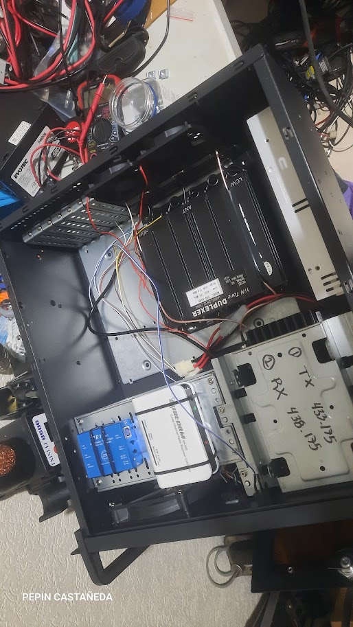

**Repetidor UHF para el área de Cuautlancingo, Puebla, con enlaces EchoLink y AllStarLink; relacionado con Radio Pasillo Poblano, proyecto de XE1TTS.**

### 📟 DAPNET

Recepción de mensajes como en los años 80: los famosos **“beepers”** mediante la red DAPNET.

  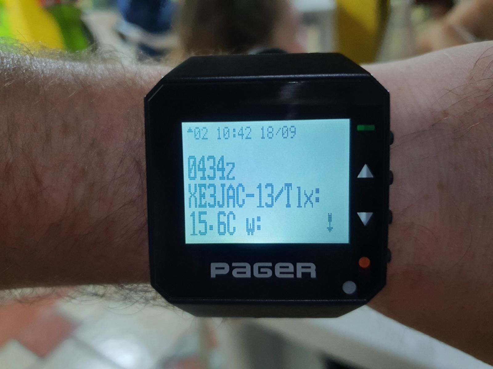

### 🛰️ TinyGS · Weather Station · RTL-SDR / OpenWebRX+

- **TinyGS — XE3JAC**
- **Weather Station / ThingSpeak**
- **RTL-SDR / OpenWebRX+ — Puebla**

  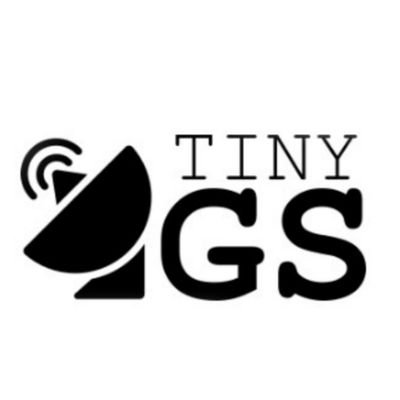
  
  

### 🖨️ Impresión 3D

La impresión 3D forma parte habitual del Shack y la utilizo para fabricar accesorios de radio, piezas, soportes, cajas y componentes para distintos proyectos.

  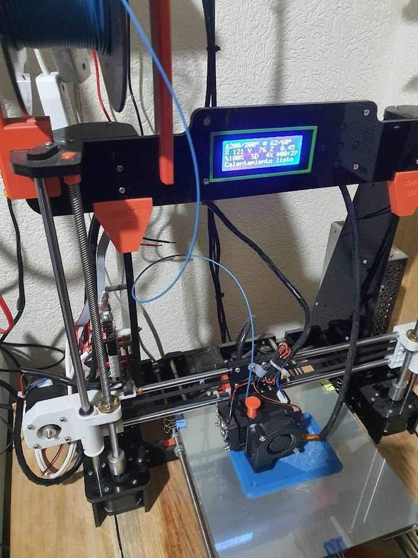

**Mi primera impresora 3D, utilizada para imprimir accesorios de radio y muchos otros proyectos.**

## 🔧 Electrónica, restauración y construcción

Me gusta la electrónica, restaurar radios y construir interfaces o accesorios que necesito para mi estación.

  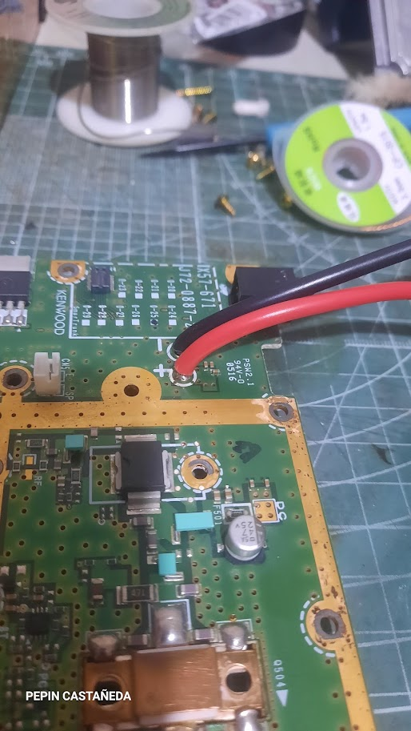
  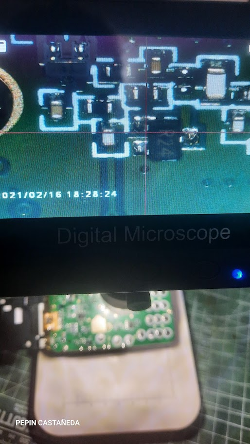
  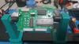

- Preparación de equipos Kenwood UHF para infraestructura de repetidor.
- Modificación de radios **Quansheng UV-K5** para ampliar posibilidades de recepción, incluyendo HF.
- Desarrollo desde cero de una **interfaz IF-10 para Kenwood TS-140S**.

## 🕰️ Drake TR-4C / RV-4C — historia familiar

El conjunto **Drake TR-4C y RV-4C** perteneció a **XE3Z — José Antonio Castañeda Melgoza**. Hoy forma parte de mi estación y representa una parte importante de la historia familiar dentro de la radioafición.

  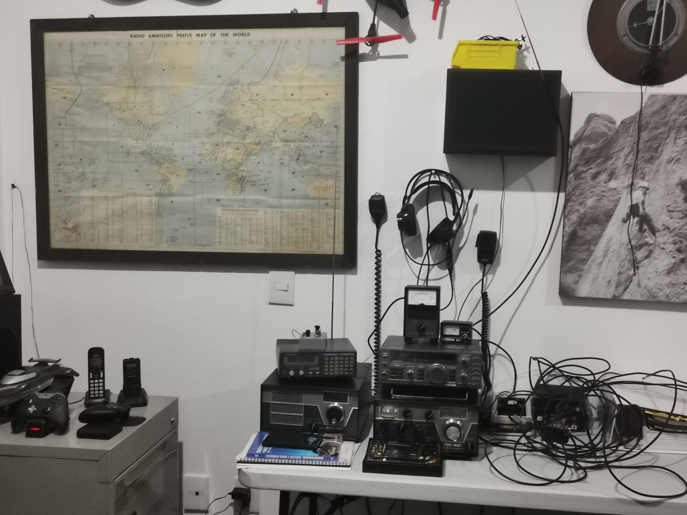

> **La radioafición también es preservar, restaurar y transmitir historias.**

## 🏕️ POTA, antenas y energía

  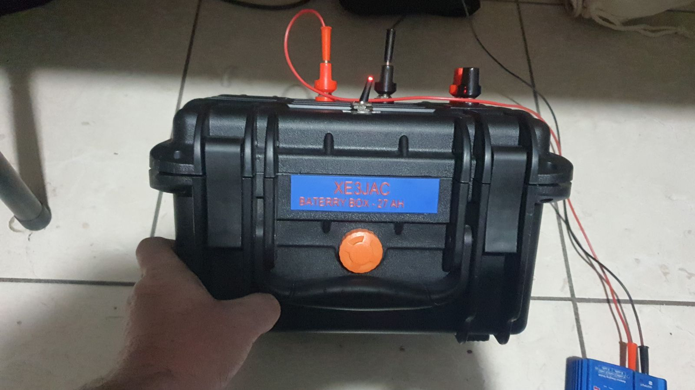
  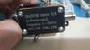
  

- Battery Box para operación **P.O.T.A.**
- Antena End Fed para las bandas de **10, 15, 20 y 40 metros**.
- **Icom IC-7300** — modificación de batería / alimentación para operación portátil.
- **Kenwood TS-140S** — modificación de batería / alimentación.

## 🖼️ Galería XE3JAC

Parte del archivo fotográfico del Shack y de los proyectos:

  
  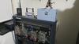
  

- **Radio Shack XE3JAC** — evolución de la estación y área de operación.
- **Rack del Shack** con nodos y proyectos como Indy APRS, OpenWebRX+, DireWolf, AllStarLink y otros.
- Electrónica, restauración, APRS, SDR, infraestructura digital, operación portátil y fabricación de accesorios.

## 🔗 Enlaces

- [QRZ — XE3JAC](https://www.qrz.com/db/XE3JAC)
- [GitHub — XE3JAC](https://github.com/XE3JAC)
- [Indy Open APRS](https://github.com/XE3JAC/IndyOpen-APRS-Project)
- [TinyGS — XE3JAC](https://app.tinygs.com/station/XE3JAC@5666652471)
- [Weather Station — ThingSpeak](https://thingspeak.com/channels/2357494)
- [Zello — REPETIDOR XE3JAC](https://on.zello.com/j5hdyu)
- [DAPNET](https://hampager.de)

---

  <strong>Gracias por tu visita. 73's de XE3JAC</strong>

