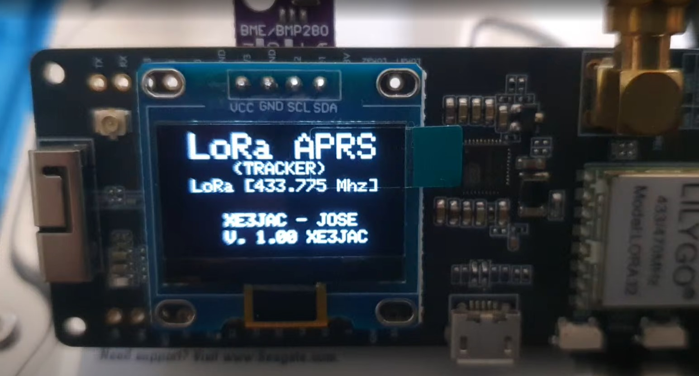
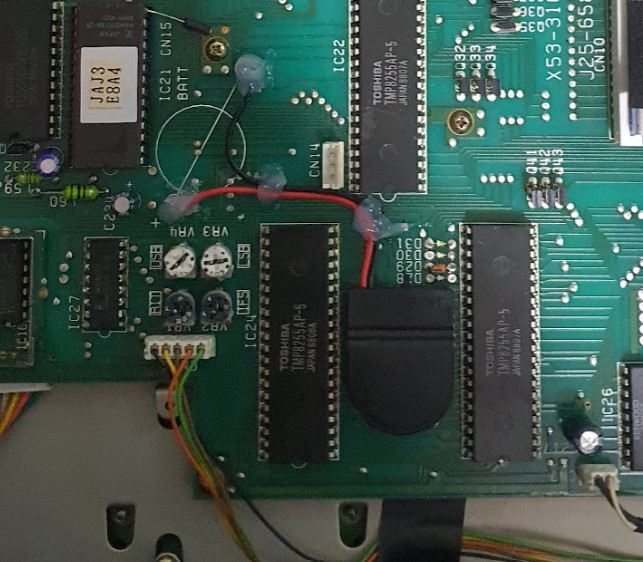

# XE3JAC — José Antonio Castañeda Audiffred

**Radioafición · Informática · Electrónica · APRS · SDR · Raspberry Pi · Microcontroladores · Impresión 3D**

Puebla, México 🇲🇽

  

## Sobre XE3JAC

Soy **José Antonio Castañeda Audiffred, XE3JAC**.

Soy **Licenciado en Informática** y **Maestro en Migración de Sistemas Computacionales**. Mi estación es también un laboratorio donde conviven la radiofrecuencia, el software, las redes, la electrónica, los microcontroladores y la fabricación digital.

### Comunidades

- **Federación Mexicana de Radio Experimentadores**
- **Alfa Delta DX Group — 10AD1986**
- **HamSphere — XE3JAC**

## Radio Shack

Mi Shack ha ido integrando equipos **HF/VHF/UHF**, nodos digitales, servidores de radio, receptores SDR, proyectos APRS y herramientas para electrónica e impresión 3D.

  
  

## Proyectos y tecnologías

### APRS / WX / Indy Open APRS

Trabajo con proyectos APRS y WX, incluyendo experimentación con **LoRa en 433 MHz** y APRS en **VHF 144.390 MHz**.

  

También desarrollo y documento **Indy Open APRS**, como parte de una plataforma abierta y en evolución para radioaficionados.

### DMR · NXDN · EchoLink · AllStarLink

También experimento con **DMR, NXDN, EchoLink y AllStarLink**.

  

Repetidor UHF para el área de **Cuautlancingo, Puebla**, con enlaces EchoLink y AllStarLink; relacionado con **Radio Pasillo Poblano**, proyecto de **XE1TTS**.

### DAPNET

Recepción de mensajes como en los años 80: los famosos **“beepers”** mediante la red DAPNET.

  

### Impresión 3D

La impresión 3D forma parte de mis proyectos y la utilizo para fabricar accesorios de radio y muchas otras piezas.

  

## Electrónica, restauración y construcción

Me gusta la electrónica, restaurar radios y construir interfaces o accesorios para la estación.

  
  
  

- Preparación de equipos Kenwood UHF para repetidores.
- Modificación de radios **Quansheng UV-K5** para recepción de bandas HF y más.
- Desarrollo desde cero de una **interfaz IF-10 para Kenwood TS-140S**.

## Drake TR-4C / RV-4C — historia familiar

El conjunto **Drake TR-4C y RV-4C** perteneció a **XE3Z — José Antonio Castañeda Melgoza**. Hoy forma parte de mi estación y representa una parte importante de la historia familiar dentro de la radioafición.

  

> **La radioafición también es preservar, restaurar y transmitir historias.**

## Operación portátil, energía y accesorios

  
  
  

- **Battery Box** para operación P.O.T.A.
- **Icom IC-7300** — modificación de batería / alimentación para operación portátil.
- **Kenwood TS-140S** — modificación de batería / alimentación.

## Rack y proyectos de estación

  

Rack del Shack con nodos y proyectos como **Indy APRS, OpenWebRX+, DireWolf, AllStarLink** y otros sistemas de radio y monitoreo.

## Galería XE3JAC

El sitio web reúne fotografías del Shack y de distintos proyectos. Cada imagen conserva su contexto y reseña principal.

  
  
  

## Enlaces

- [QRZ — XE3JAC](https://www.qrz.com/db/XE3JAC)
- [GitHub — XE3JAC](https://github.com/XE3JAC)
- [Indy Open APRS](https://github.com/XE3JAC/IndyOpen-APRS-Project)
- [TinyGS — XE3JAC](https://app.tinygs.com/station/XE3JAC@5666652471)
- [Weather Station — ThingSpeak](https://thingspeak.com/channels/2357494)
- [Zello](https://on.zello.com/j5hdyu)
- [DAPNET](https://hampager.de)

---

  <strong>Gracias por tu visita. 73's de XE3JAC.</strong>

